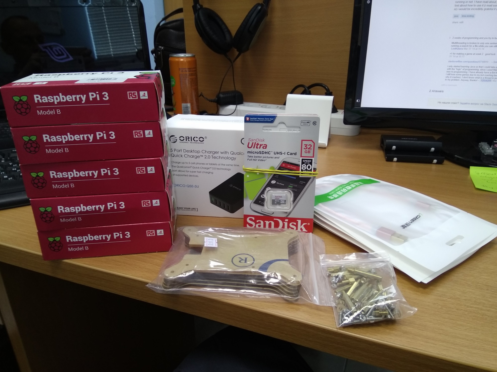
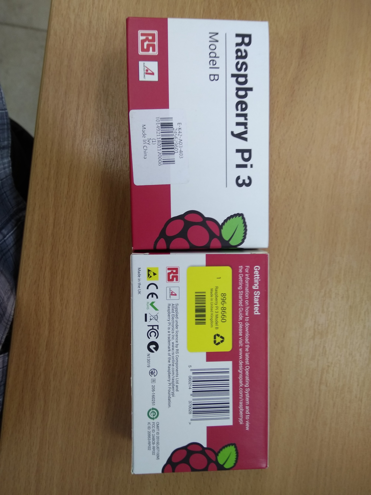
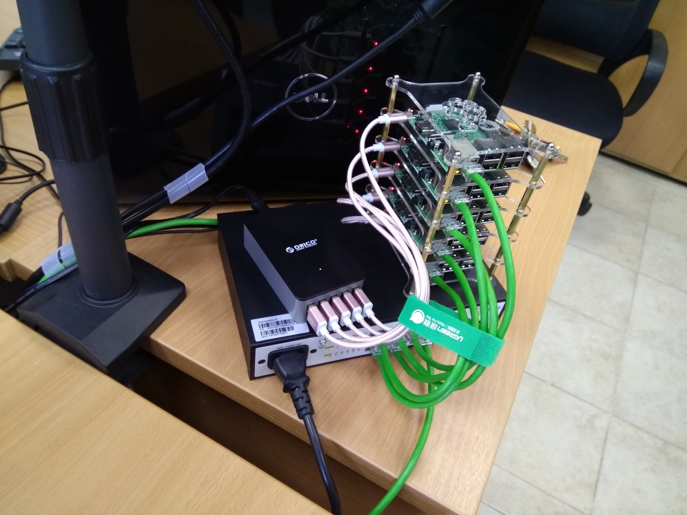

# Hardware

Components:

* 5 x [Raspberry Pi 3 Model B](https://ru.aliexpress.com/item/In-stock-original-RS-made-in-the-uk-raspberry-pi-3-model-B-board-with-wifi/32691965709.html)
* 1 x [Acrylic case, 5 layers](https://ru.aliexpress.com/item/Raspberry-Pi-3-model-B-Acrylic-Clear-Case-5-layer-Transparent-Shell-Acrylic-Enclosure-Box/32651224612.html)
* 1 x [ORICO QSE-5U power supply](https://ru.aliexpress.com/item/ORICO-UC5P-GY-5-Port-Micro-USB-charger-40W-Smart-Supercharger-for-Iphone-Ipad-Samsung-Gray/32357277804.html)
* 5 x [SanDisk Ultra microSDHC UHS-I card, class 10, 32 GB](https://www.citilink.ru/catalog/computers_and_notebooks/media/flashcards/1008942/)
* 5 x [Ugreen MicroUSB nylon cable, 25 cm](https://ru.aliexpress.com/item/Ugreen-5V2A-Micro-USB-Cable-Metal-Nylon-Braided-Wire-USB-Charger-Sync-Data-Cable-for-Samsung/32755920140.html)

